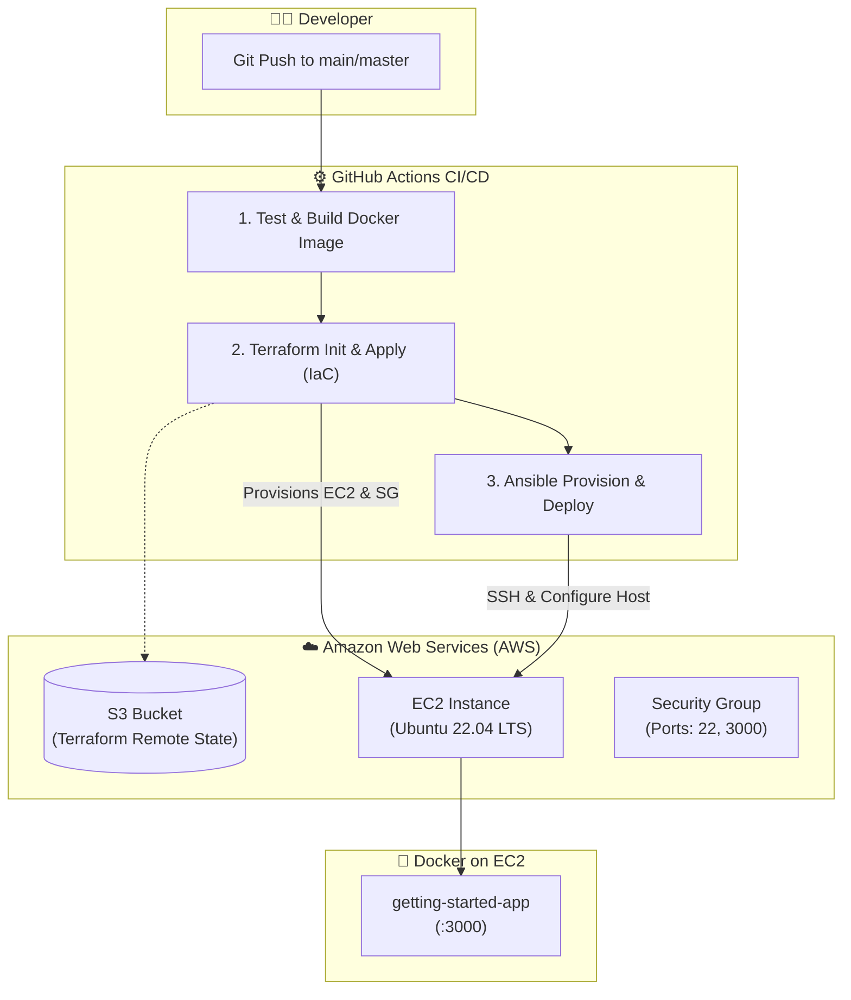

# 🚀 Node.js To-Do App & End-to-End DevOps CI/CD Pipeline

<div align="center">


<p align="center">
  A production-ready containerized <b>Node.js / Express</b> web application with automated <b>Infrastructure as Code (Terraform)</b>, <b>Configuration Management (Ansible)</b>, and continuous deployment via <b>GitHub Actions</b> to <b>AWS EC2</b>.
</p>

[Key Features](#-key-features) • [Architecture](#-architecture--workflow) • [Quick Start](#-quick-start) • [DevOps & CI/CD](#-devops--cicd-pipeline) • [Project Structure](#-project-structure)

---

</div>

## 📌 Overview

This repository demonstrates a complete, modern **DevOps lifecycle** for a containerized full-stack application:
- **Application**: Lightweight Node.js & Express REST API with SQLite / MySQL persistence and a responsive web UI.
- **Containerization**: Secure, lightweight Docker image based on `node:24-alpine` running under a non-root user.
- **Infrastructure as Code (IaC)**: Terraform provisions AWS EC2 instances, Security Groups, and SSH key pairs with S3 remote state storage.
- **Configuration Management**: Ansible automates server setup, Docker installation, repository cloning, and zero-downtime container rollout.
- **CI/CD Pipeline**: GitHub Actions automates testing, image building, cloud provisioning, and deployment on every push.

---

## 🏗️ Architecture & Workflow



---

## ✨ Key Features

- ⚡ **Lightweight REST API & UI**: Built with Express 5 and modern JavaScript.
- 🔒 **Security Best Practices**: Non-root container execution (`USER node`), least-privilege AWS Security Groups, and secure secret injection.
- 📦 **Multi-Database Support**: Out-of-the-box support for both SQLite (`todo.db`) and MySQL.
- ☁️ **Automated Infrastructure**: Declarative AWS EC2 provisioning via Terraform with remote S3 state locking.
- 🛠️ **Idempotent Deployment**: Ansible playbooks ensure reproducible server configuration and container restarts.
- 🔄 **Fully Automated CI/CD**: Zero manual intervention needed from code commit to cloud deployment.

---

## 🚀 Quick Start

### 1. Running with Docker (Recommended)

Make sure you have [Docker](https://www.docker.com/) installed and running on your machine.

```bash
# 1. Clone the repository
git clone https://github.com/<your-username>/getting-started-app.git
cd getting-started-app

# 2. Build the Docker image
docker build -t getting-started-app .

# 3. Run the container
docker run -d -p 3000:3000 --name todo-app getting-started-app
```

Now open your browser and navigate to:
👉 **`http://localhost:3000`**

To stop and remove the container:
```bash
docker stop todo-app && docker rm todo-app
```

---

### 2. Running Locally (Native Node.js)

#### Prerequisites
- [Node.js](https://nodejs.org/) (v18+)
- [npm](https://www.npmjs.com/)

```bash
# Install dependencies
npm install

# Start the application in development mode (with nodemon)
npm run dev
```

The application will start on **`http://localhost:3000`**.

---

## 🛠️ DevOps & CI/CD Pipeline

The GitHub Actions workflow in `.github/workflows/ci-cd.yaml` executes across 3 automated stages on every push to `main` or `master`:

| Stage | Job Name | Description |
| :--- | :--- | :--- |
| **1. CI** | `test_and_build` | Validates Dockerfile syntax and builds the container image. |
| **2. IaC** | `provision_with_terraform` | Creates/updates AWS EC2 instance, Security Groups, and outputs public IP. |
| **3. CD** | `deploy_with_ansible` | Connects via SSH, installs Docker, pulls latest code, builds & runs container. |

---

### 🔑 Required GitHub Secrets

To enable the automated CI/CD pipeline, add the following secrets in your GitHub repository (**Settings > Secrets and variables > Actions**):

| Secret Name | Description |
| :--- | :--- |
| `AWS_ACCESS_KEY_ID` | AWS IAM Access Key with EC2 & S3 permissions |
| `AWS_SECRET_ACCESS_KEY` | AWS IAM Secret Key |
| `EC2_SSH_KEY` | Private SSH key (PEM) to connect to the EC2 instance |
| `EC2_SSH_PUBLIC_KEY` | Matching Public SSH key deployed to AWS EC2 |

---

### 📁 Manual Infrastructure Provisioning

#### Terraform (Infrastructure as Code)
```bash
cd terraform

# Initialize with S3 backend
terraform init \
  -backend-config="bucket=tf-state-getting-started-app" \
  -backend-config="key=terraform.tfstate" \
  -backend-config="region=us-east-1"

# Plan and apply
terraform plan -var="ec2_public_key=ssh-rsa YOUR_PUBLIC_KEY"
terraform apply -auto-approve -var="ec2_public_key=ssh-rsa YOUR_PUBLIC_KEY"
```

#### Ansible (Configuration & Deployment)
```bash
cd ansible

# Run playbook directly against target EC2 host
ansible-playbook -i inventory.ini playbook.yml \
  --extra-vars "repo_url=https://github.com/<your-username>/getting-started-app"
```

---

## 📂 Project Structure

```text
getting-started-app/
├── .github/
│   └── workflows/
│       └── ci-cd.yaml          # GitHub Actions CI/CD Pipeline
├── ansible/
│   └── playbook.yml            # Server configuration & Docker deployment playbook
├── terraform/
│   ├── main.tf                 # AWS EC2, Key Pair & Security Group resources
│   ├── variables.tf            # Terraform input variables
│   └── outputs.tf              # EC2 Public IP output definition
├── src/
│   ├── index.js                # Express application entry point
│   ├── persistence/            # SQLite & MySQL database handlers
│   ├── routes/                 # API route handlers (GET, POST, PUT, DELETE)
│   └── static/                 # Frontend assets (HTML, CSS, JS)
├── Dockerfile                  # Production-optimized Alpine container
├── .dockerignore               # Files excluded from Docker context
├── package.json                # Node.js dependencies & scripts
└── README.md                   # Project documentation
```

---

## 🔒 Security Highlights

- **Non-Root Container**: The application runs under user `node` (`UID 1000`) instead of `root`.
- **Ephemeral Credentials**: SSH keys are securely injected during CI/CD execution and wiped immediately after playbook completion.
- **Targeted Firewall Rules**: AWS Security Group strictly opens only port `22` (SSH) and port `3000` (HTTP).

---

## 📄 License

This project is licensed under the [MIT License](LICENSE).

---

<div align="center">
  <sub>Built with ❤️ for modern Cloud & DevOps engineering.</sub>
</div>
